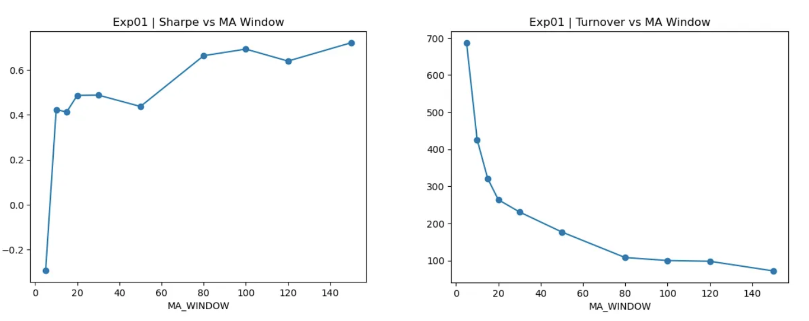
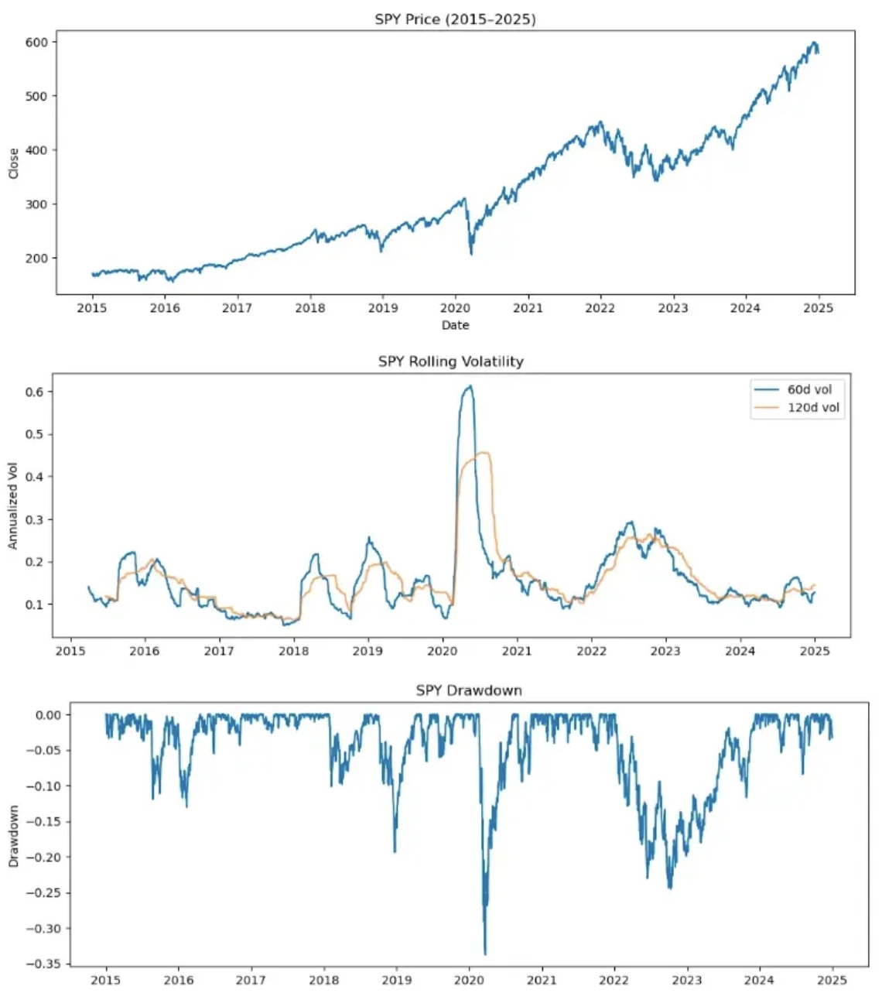
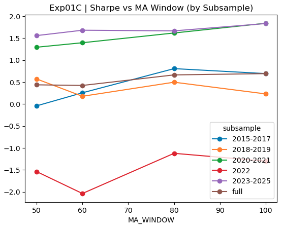
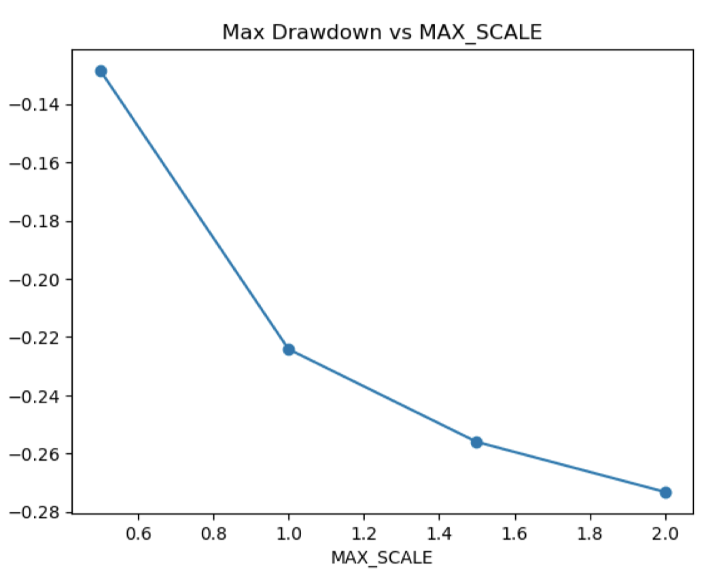
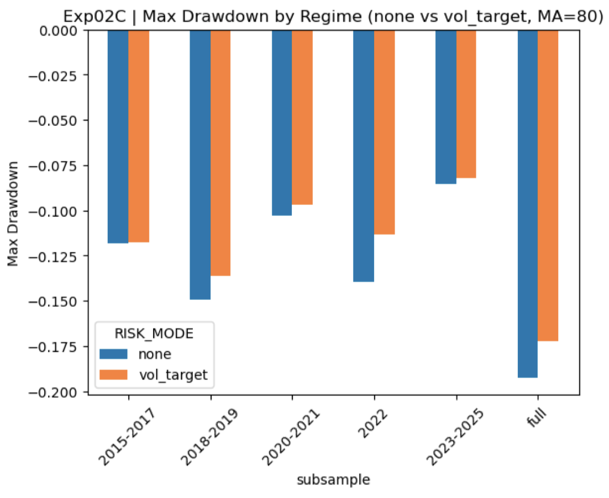
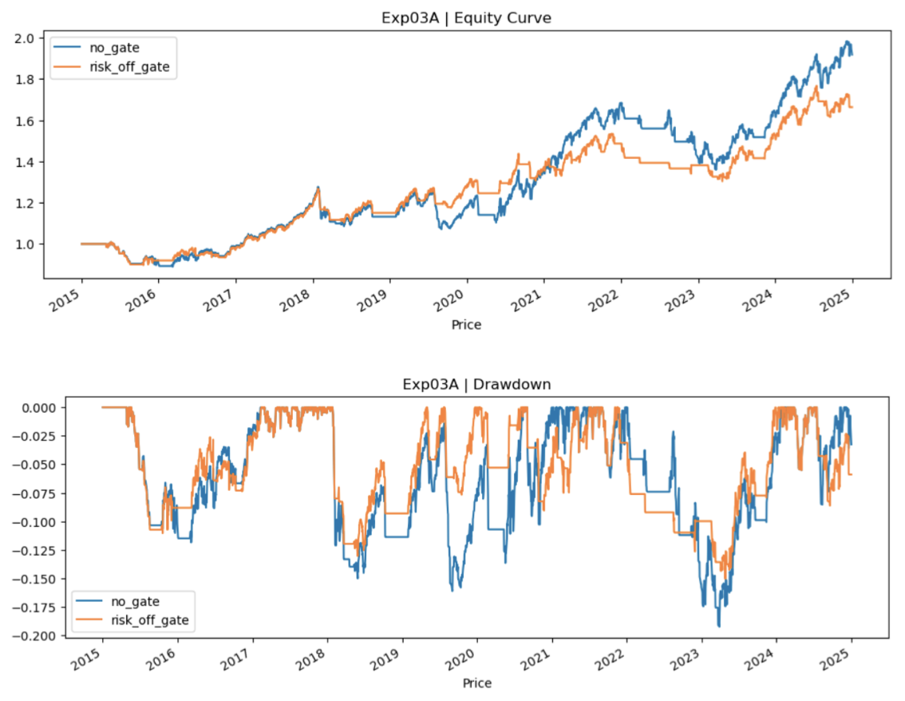
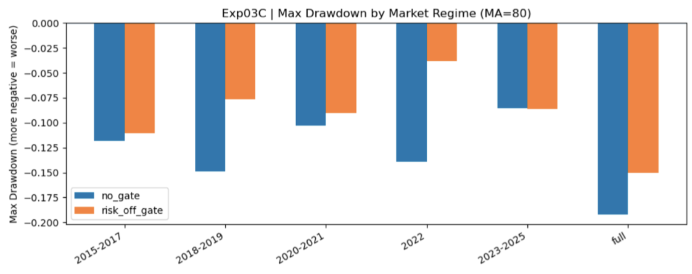
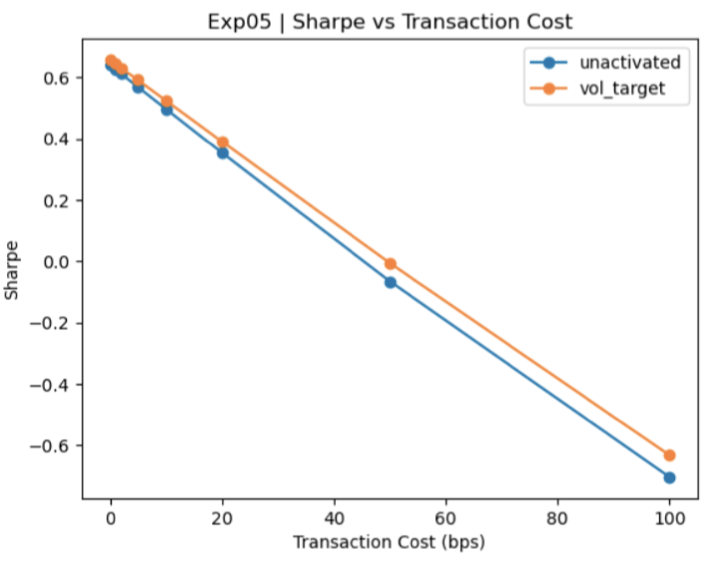
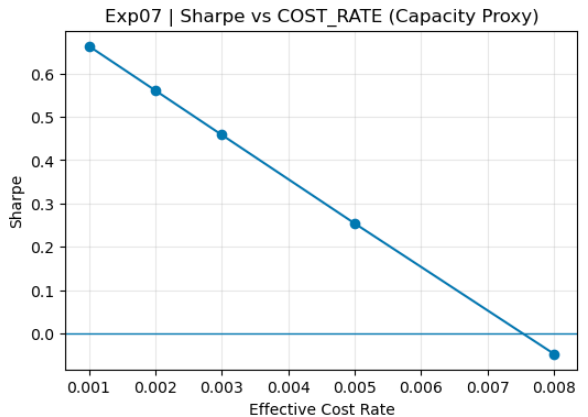

# MA Trend-Following Research Report

## 1. Research Goals

This project builds a **controlled quantitative research testbed** using a simple moving-average (MA) trend-following strategy. Rather than maximizing raw alpha, the objective is to **study robustness, failure modes, and deployability** under realistic market conditions.

Specifically, the project aims to:
- Build a complete quantitative research workflow, from signal validation to execution realism and capacity feasibility.
- Use a simple MA strategy as a *controlled baseline* to isolate key components of systematic strategies, including:
  - signal robustness,
  - risk controls (volatility targeting and risk-off gate),
  - execution frictions (transaction costs and delays),
  - deployable capacity,
  - out-of-sample generalization.
- Identify practical limits that distinguish **theoretical alpha** from **tradable and scalable alpha**.

---

## 2. Research Structure

The research is organized into a sequence of experiments, each probing a different layer of the strategy stack:

1. **Signal Robustness** (Exp01–Exp02)
2. **Risk Control Diagnostics** (Exp03–Exp04)
3. **Execution Realism** (Exp05–Exp06)
4. **Capacity Feasibility** (Exp07)
5. **Out-of-Sample Validation** (Exp08)

---

## 3. Experimental Setup

- **Asset**: SPY
- **Period**: 2015-01-01 to 2024-12-31
- **Frequency**: Daily close
- **Baseline Strategy**: Long-only MA trend-following
- **Baseline Parameters**:
  - MA window selected from robustness analysis
  - COST_RATE = 0.1% unless otherwise stated

---

## 4. Signal Robustness

### Exp01A – MA Window Stability

**Question**: Is the MA signal structurally robust to parameter perturbation, or driven by point-optimal tuning?

**Method**: Sweep MA window values under realistic transaction costs.

**Observation**:
- Very short MA windows exhibit high turnover and unstable performance, consistent with noise-driven overtrading.
- A broad Sharpe plateau emerges for MA windows between roughly 80–120, indicating tolerance to parameter perturbation.
- Large MA windows suffer from delayed reaction and reduced returns.

**Conclusion**:
The MA signal exhibits **structural stability** under moderate parameter perturbations and is not driven by parameter-specific overfitting.

---

### Exp01B – Market Regime Context

To interpret regime-dependent behavior, market structure is visualized via price dynamics, rolling volatility, and drawdowns.

This provides a reference for later subsample and regime-based analysis.

---

### Exp01C – Plateau Across Regimes

**Question**: Does the parameter stability persist across different market regimes?

**Method**: For each subsample regime, sweep MA window and examine performance smoothness.

**Conclusion**:
The presence of broad plateaus across regimes suggests that the signal’s behavior reflects a **structural property of trend-following**, rather than regime-specific overfitting.

---

## 5. Risk Control Diagnostics

### Exp02 – Volatility Targeting

Volatility targeting is introduced as a continuous position-sizing mechanism to manage risk exposure without altering the underlying signal.

**Key insight**:
- Returns do not scale linearly with leverage.
- Increasing leverage amplifies downside tail risk faster than expected returns.

**Conclusion**:
Volatility targeting consistently reduces drawdowns, particularly in stressed regimes, but does not systematically improve Sharpe ratios. Its role is **risk management rather than alpha generation**.

---

### Exp03 – Risk-off Gate

A discrete risk-off gate is introduced based on realized volatility thresholds.

**Observation**:
- Risk-off gating smooths equity curves and limits drawdowns during volatile periods.
- This comes at the cost of reduced participation during strong upside trends.

**Conclusion**:
Risk-off gates are effective for downside control in choppy and stressed regimes, but their impact on returns is strongly regime-dependent.

---

## 6. Execution Realism

### Exp05 – Transaction Cost Sensitivity

**Question**: How much of the strategy’s performance survives realistic transaction costs?

**Conclusion**:
With fixed signal and risk structure, execution costs alone are sufficient to eliminate profitability beyond moderate cost levels, highlighting the gap between theoretical and tradable alpha.

---

### Exp06 – Execution Delay Sensitivity

**Question**: How sensitive is the strategy to execution timing errors?

**Conclusion**:
The dominant failure mode under execution delay is **signal timing decay**. Risk controls cannot meaningfully mitigate this degradation, indicating that the strategy’s edge relies on timely execution.

---

## 7. Capacity Feasibility

### Exp07 – Capacity Stress Test

Deployable capacity is approximated via increasing effective transaction costs as a proxy for market impact.

**Conclusion**:
The strategy remains economically tradable only up to moderate effective cost levels, beyond which performance decays rapidly, revealing a clear **capacity limit**.

---

## 8. Out-of-Sample Validation

### Exp08 – Train/Test Evaluation

Parameters are selected using a training period only, then evaluated on an unseen test period.

**Conclusion**:
Using train-only parameter selection, the strategy exhibits stable and consistent out-of-sample behavior, supporting the generalization of the observed robustness patterns.

---

## 9. Key Takeaways

- Simple signals can be informative when studied through a **robustness-first research framework**.
- Risk controls improve survivability and robustness, not raw returns.
- Execution realism and capacity constraints dominate theoretical performance considerations.
- Understanding *how and where a strategy fails* is more valuable than maximizing in-sample performance.

---

